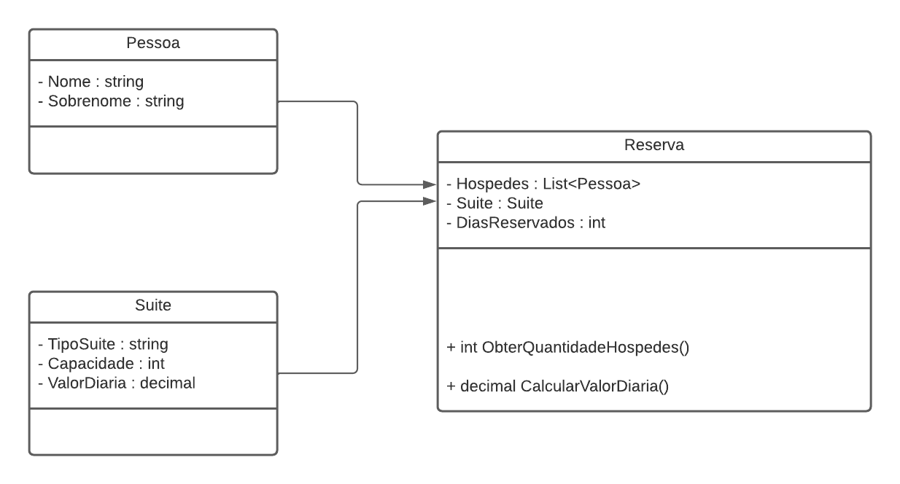

# DIO - Trilha .NET - Explorando a linguagem C#
www.dio.me

## Desafio de projeto MODIFICADO
Eu modifiquei a proposta original do desafio de projeto e criei uma simples aplicação para o gerenciamento de hospedagens em um hotel, que roda no próprio Console do computador.

## Contexto
No sistema criado, o usuário inicialmente define quais as características dos quartos (Súites) disponíveis no hotel, informando seu Tipo, Capacidade, e Valor da diária.

Em seguida, é direcionado para o Menu Principal, onde possui as opções de:
<ol>
<li>Criar nova reserva - O usuário informa os hóspedes da reserva, em qual suíte vão ficar, e a duração da reserva.</li>
<li>Ver reservas existentes - Lista os detalhes da reserva existente.</li>
<li>Excluir reserva existente - Remove uma das reservas existentes de acordo com seu index listado (iniciando em 1, não em 0).</li>
<li>Verificar tipos de suítes disponíveis - Lista as suítes registradas no ínicio do programa.</li>
<li>Encerrar o programa</li>
</ol>

## Regras e validações
1. Não deve ser possível realizar uma reserva de uma suíte com capacidade menor do que a quantidade de hóspedes, e também uma reserva só pode ter como número de hóspedes a capacidade máxima da maior súite disponível.
2. O método ObterQuantidadeHospedes da classe Reserva deverá retornar a quantidade total de hóspedes, enquanto que o método CalcularValorDiaria deverá retornar o valor da diária (Dias reservados x valor da diária).
3. Caso seja feita uma reserva igual ou maior que 10 dias, deverá ser concedido um desconto de 10% no valor da diária.

